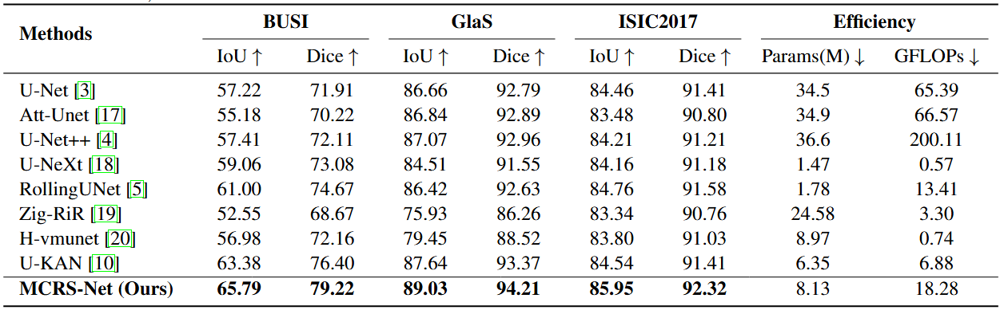

# MCRS-Net

## 0. Abstract

U-KAN and its variants have been widely used in medical image segmentation, but they do not always outperform CNN- or Mamba-based methods. This is primarily due to the fact that most methods use only KAN as a backbone network, lacking multi-scale feature extraction. Furthermore, the attention mechanism is often limited to irrelevant local regions, making it difficult to capture long-range dependencies. To address these issues, we propose MCRS-Net: Firstly, we leverage KAN to enhance nonlinear modeling capabilities and combine it with multi-scale convolution for efficient feature extraction; secondly, we introduce a regional self-attention mechanism within skip connections to focus on key details and promote feature interactions. We systematically evaluate MCRS-Net on three benchmark datasets: BUSI, GlaS, and ISIC2017. Experimental results demonstrate that it significantly outperforms existing methods in medical image segmentation tasks. The MCRS-Net code is now open source and can be accessed at https://github.com/szz2023/MCRS-Net.


## 1. Overview

<div align="center">

</div>


## 2. Main Environments

The environment installation process can be carried out as follows:

```
conda create -n MCRS-Net python=3.8
conda activate MCRS-Net
pip install torch==1.13.0 torchvision==0.14.0 torchaudio==0.13.0 
pip install packaging
pip install timm==0.4.12
pip install pytest chardet yacs termcolor
pip install submitit tensorboardX
pip install triton==2.0.0
pip install causal_conv1d==1.0.0  
pip install mamba_ssm==1.0.1
pip install scikit-learn matplotlib thop h5py SimpleITK scikit-image medpy yacs
pip install addict dataclasses pandas pyyaml albumentations tqdm tensorboardX numpy opencv-python
pip install perceptual pillow scipy tifffile typing-extensions yapf
```


## 3. Datasets

BUSI: The dataset can be found [here](https://www.kaggle.com/datasets/aryashah2k/breast-ultrasound-images-dataset) .

Glas: The dataset can be found [here](https://websignon.warwick.ac.uk/origin/slogin?shire=https%3A%2F%2Fwarwick.ac.uk%2Fsitebuilder2%2Fshire-read&providerId=urn%3Awarwick.ac.uk%3Asitebuilder2%3Aread%3Aservice&target=https%3A%2F%2Fwarwick.ac.uk%2Ffac%2Fcross_fac%2Ftia%2Fdata%2Fglascontest&status=notloggedin) .

ISIC2017: The dataset can be found [here](https://challenge.isic-archive.com/data/) .


## 4. Train the MCRS-Net

```
python train.py --arch UKAN --dataset {dataset} --input_w {input_size} --input_h {input_size} --name {dataset}_UKAN  --data_dir [YOUR_DATA_DIR]
```


## 5. Test the MCRS-Net 

```
python val.py --name ${dataset}_UKAN --output_dir [YOUR_OUTPUT_DIR] 
```


## 6. Comparison With State of the Arts

The performance of the proposed method is compared with the state-of-the-art models on the BUSI, GlaS, and ISIC2017 datasets, where the best results are shown in bold.

<div align="center">

</div>


## 7. Acknowledgement

Thanks to [U-KAN](https://github.com/Zhaoyi-Yan/U-KAN) and [CATANet](https://github.com/Zhaoyi-Yan/U-KAN)for their outstanding works.
